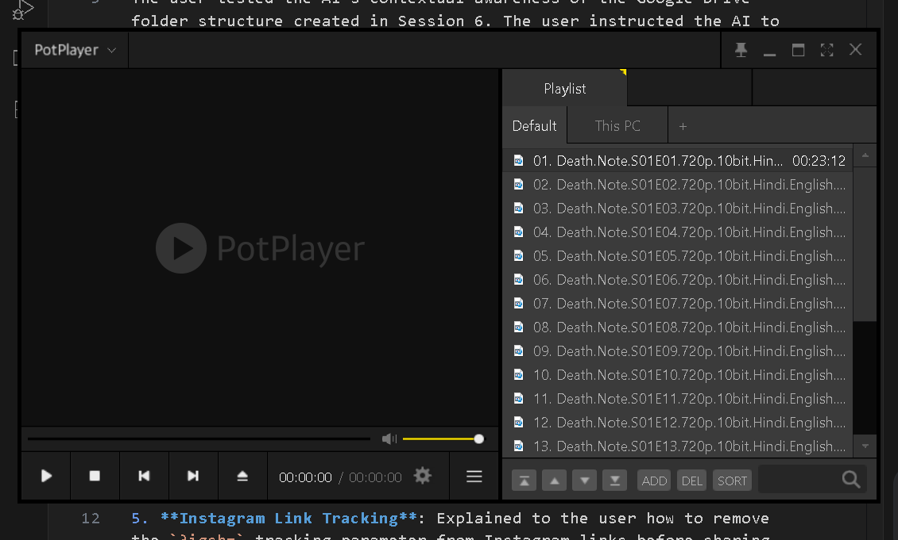

# Session 7 Log
**Date**: April 22, 2026

## Summary
The user tested the AI's contextual awareness of the Google Drive folder structure created in Session 6. The user instructed the AI to update the `PROJECT_HISTORY.md` to ensure the AI "Master Key Prompt" forces all future AI agents to ingest all memory logs, transcripts, and workflows fully on their first prompt. The user evaluated third-party scripts and established a Brave Browser rule. Later, the user shifted focus to extensive hardware and system troubleshooting for Tawfeeq Ahmad Bhat, resolving an MTP connection issue with a Realme X7 5G, diagnosing Jio 5G hotspot thermal throttling, untangling a nested Google Drive & OneDrive sync conflict, and restoring the `desktop.ini` icon for a custom C:\Desktop folder.

## Key Decisions
1. **Master Key Prompt Overhaul**: Added a "CRITICAL REQUIREMENT" that AI must read all transcripts and logs in one go without skipping anything.
2. **badclaude Evaluated**: Deemed unsafe and useless (Crypto miner joke, prompt injection risks).
3. **RedMagic 9 Pro APK Evaluated**: Confirmed as clickbait—it will not turn a low-end phone into a PS5.
4. **Brave Browser Preference**: Established a rule that AI must use Brave Browser (not Chrome) for all web browsing tasks because the user's accounts are logged in there.
5. **Instagram Link Tracking**: Explained to the user how to remove the `?igsh=` tracking parameter from Instagram links before sharing on WhatsApp to maintain privacy.
6. **Android USB/MTP Fix**: Educated the user on Android's default "Charging Only" security feature to fix the "Folder is empty" issue when connecting a Realme X7 5G to the PC.
7. **Jio 5G Hotspot & Thermal Throttling**: Diagnosed severe speed drops (from 8MB/s to 400KB/s) and battery drain during Hotspot usage as a combination of Jio FUP logic changes and hardware thermal throttling. Advised using USB tethering or a physical fan to prevent the 5G modem from overheating.
8. **Cloud Sync Conflict Resolution**: Identified and resolved a critical file-lock error caused by the user nesting a Microsoft OneDrive folder inside a Google Drive directory. Directed the user to "Unlink this PC" to safely delete the nested duplicates.
9. **Desktop Folder Customization**: Executed a PowerShell script to inject a `desktop.ini` file and set read-only attributes on `C:\Desktop`, restoring the official Windows Desktop icon to the user's custom high-speed folder.
